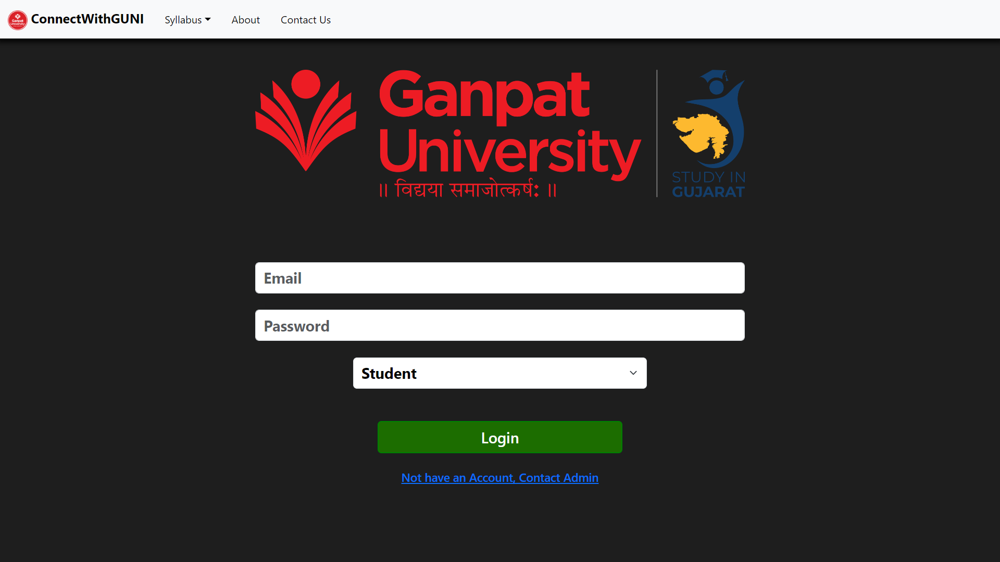

# Connect With GUNI - College Management System

Connect With GUNI is a Learning Management Website developed for maintaining all necessary and important things for students daily in the College/University. Here the staff/Faculties, who are handling the subjects, will be responsible for adding materials and attendance for the Students. Each staff member will be given a separate login ID and password based on the subject they handle. This Website also provides the remainder notes that students or faculties can set in their accounts. Also, an Admin Account is created to manage all the things

## Technologies Used

- HTML
- CSS
- Javascript
- Bootstrap
- React
- Node
- Express
- Mongo
- MERN

## Getting Started

This section explains how to set up your project locally for development.

### Prerequisites

Make sure you have the following installed on your local machine:

- **Node.js**: [Download and install](https://nodejs.org/)
- **npm** or **yarn**: Comes bundled with Node.js.

### Installation

To install the project, follow these steps:

1. **Clone the repository:**

   ```bash
   git clone https://github.com/debugger-snjy/Connect-With-GUNI-Frontend
   ```

2. **Installing the Node Packages:**

   ```bash
   npm install
   ```

3. **Running the Application:**

   ```bash
   npm start
   ```

4. **Running the Backend Project:**
   Also, As we have a different [Backend Project](https://github.com/debugger-snjy/Connect-With-GUNI-Backend), then we will download, install, and run the Backend Project like we have run this project

## Screenshots

Login Page:


